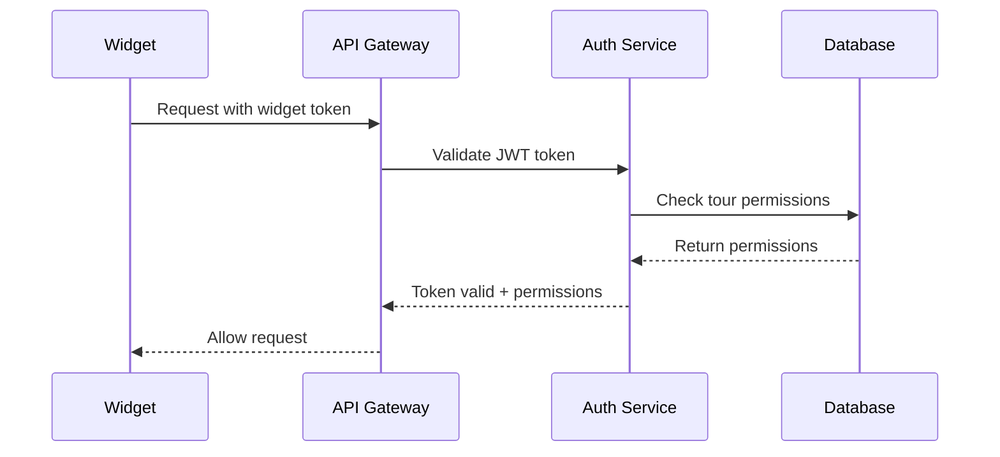

# Vocaria 1.1 – Product Requirements Document (PRD)

## 0 · Summary

Vocaria es un *voice‑first virtual showing assistant* que vive dentro de cada recorrido Matterport y conversa con los visitantes, aprovechando **ElevenLabs Conversational AI (CAI)** para la lógica dialogal y **Windsurf AI** para la generación automatizada del backend Python/FastAPI, frontend React + TypeScript y la infraestructura IaC. El dominio oficial será **vocaria.app** y el producto se distribuirá en modo *SaaS*. A continuación se definen alcance de MVP, requisitos funcionales y no‑funcionales, arquitectura, pricing, KPIs, riesgos y roadmap.

---

## 1 · Visión

> **Hacer que cada recorrido 3D se vea, se sienta y se venda como si un agente estuviera presente 24×7.**

Vocaria democratiza el *hosted tour* ofreciendo un agente conversacional que conoce los detalles del inmueble, responde preguntas en voz humana y guía al prospecto hasta agendar una visita presencial.

## 2 · Objetivos de negocio

| Objetivo                    | Métrica               | Meta 12 meses                                                                                                                                   |
| --------------------------- | --------------------- | ----------------------------------------------------------------------------------------------------------------------------------------------- |
| Generar leads cualificados  | Leads/1000 visitas    | ≥ 45                                                                                                                                            |
| Reducir tiempo de respuesta | Latencia 95‑percentil | ≤ 1.2 s voz / 0.8 s texto ([elevenlabs.io](https://elevenlabs.io/docs/conversational-ai/best-practices/prompting-guide?utm_source=chatgpt.com)) |
| Monetizar tours             | ARR                   |  ≥ USD 120k                                                                                                                                    |

## 3 · Personas clave

* **Agente inmobiliario**: busca diferenciar sus listings y filtrar leads serios.
* **Propietario tech‑savvy**: desea autopublicar el tour y conversar con posibles inquilinos sin revelarse.
* **Visitante web/móvil**: quiere respuestas inmediatas y orientación durante el recorrido.

## 4 · Alcance

### 4.1 MVP (*Fase 0–1, 8 semanas*)

1. **Widget embebible** en ES / EN con voz *Jessie* (ElevenLabs) y texto.
2. **Objetivo del agente** configurable ("Agendar visita") y *success criteria* nativo CAI ([elevenlabs.io](https://elevenlabs.io/docs/cookbooks/conversational-ai/quickstart?utm_source=chatgpt.com)).
3. **Extracción automática** de: nombre de ambiente, m², superficie indoor/outdoor y Mattertags mediante Showcase SDK + Model API ([static.matterport.com](https://static.matterport.com/api-doc/2024.04.32-main-g69a950c/reference/graphdoc/model/dimensions.doc.html?utm_source=chatgpt.com), [matterport.github.io](https://matterport.github.io/showcase-sdk/modelapi_pi_dimension_estimates.html?utm_source=chatgpt.com)).
4. Ingesta de **hasta 5 PDFs o 25 MB** por tour como *knowledge base* CAI.
5. Panel de control mínimo en `app.vocaria.app` para crear agente y copiar `<script>` de inserción.
6. **Checkout Stripe** (sandbox) y manejador de *webhooks*.

### 4.2 Post‑MVP Roadmap

| Fase | Hito                                    | Notas                         |
| ---- | --------------------------------------- | ----------------------------- |
| 2    | *Server Tools* CAI → API Calendly & CRM | Habilita reservas automáticas |
| 3    | Plan *Sólo Chat*                        | Texto sin voz (coste bajo)    |
| 4    | **Telephony** (SIP) CAI                 | Llamadas entrantes            |
| 5    | Multi‑currency & LGPD/25.326 compliance | Expansión LatAm               |

## 5 · Requisitos funcionales

* **F1**: Crear agente con `agent_id` CAI y campo `objective`.
* **F2**: Incrustar widget en tour público o privado con token JWT.
* **F3**: Capturar evento *room‑enter* y enviar `{roomName, area_m2}` al backend.
* **F4**: Registrar lead cuando el visitante proporcione email/whatsapp.
* **F5**: Panel debe listar tours, consumo de minutos TTS y leads exportables CSV.
* **F6**: Autenticación de usuarios con JWT y refresh tokens.
* **F7**: Rate limiting para prevenir abuso de API.

## 6 · Requisitos no‑funcionales

| NFR    | Descripción    | Objetivo                                                                                                                          |
| ------ | -------------- | --------------------------------------------------------------------------------------------------------------------------------- |
| NFR‑01 | Latencia voz   | P95 ≤ 1.2 s ([elevenlabs.io](https://elevenlabs.io/docs/conversational-ai/best-practices/prompting-guide?utm_source=chatgpt.com)) |
| NFR‑02 | Concurrencia   | ≥ 100 sesiones simultáneas                                                                                                        |
| NFR‑03 | Seguridad      | TLS 1.3, OWASP Top‑10 mitigado, JWT authentication                                                                                                    |
| NFR‑04 | Privacidad     | Retención 90 días, GDPR+LGPD+AR 25.326, encriptación en reposo                                                                                            |
| NFR‑05 | Disponibilidad |  ≥ 99.5% uptime mensual con health checks                                                                                       |
| NFR‑06 | Escalabilidad  | Auto-scaling hasta 1000 usuarios concurrentes                                                                                   |

## 7 · Arquitectura

```mermaid
flowchart LR
  subgraph Frontend
    A[Widget React] -- postMessage --> B(Showcase SDK)
  end
  A -- WSS: visitor_event --> S(Voice Router)
  subgraph Backend (FastAPI)
    S --> C[CAI Proxy]
    S --> D[Lead Service]  
    S --> E[Billing Service]
    S --> F[Auth Service]
    C --> G((ElevenLabs CAI Cloud))
    B -->|GraphQL| H[Matterport Client]
    H --> S
  end
  D --> I[(PostgreSQL + PGVector)]
  E --> J((Stripe))
  F --> K[(Redis Cache))
  S --> L[Rate Limiter]
```

*Windsurf AI* genera `voice_router.py`, `matterport_client.py`, `widget.tsx` y `auth_service.py` a partir de este PRD.

## 8 · Pipeline de extracción Matterport

1. `viewer.on(Room.ENTER)` obtiene `roomId`.
2. `POST /graphql` con query `dimensionEstimates { area areaIndoor height }` ([static.matterport.com](https://static.matterport.com/api-doc/2024.04.32-main-g69a950c/reference/graphdoc/model/dimensions.doc.html?utm_source=chatgpt.com)).
3. Serializa JSON y lo envía como contexto (*knowledge\_base\_inline*) al agente CAI.
4. Almacena vector embedding en PGVector usando cosine similarity.
5. *Batch tests* CAI validan que el bot menciona dimensión actual ≥ 85% de diálogos ([elevenlabs.io](https://elevenlabs.io/blog/building-an-agent-for-our-own-docs?utm_source=chatgpt.com)).

## 9 · Pricing & costes actualizado

| Plan                   | Precio USD/mes | Incluye                          | Exceso       | Margen |
| ---------------------- | -------------- | -------------------------------- | ------------ | ------ |
| **Starter Chat+Voice** |  59            | 1 tour, 300 min TTS, 200 interp. | 0.15 $/min  | 33%    |
| **Starter Chat**       |  29            | 1 tour, solo texto, 1000 msgs   | 0.008 $/msg | 38%    |
| **Growth**             |  129           | 5 tours, 800 min, analytics     | 0.14 $/min  | 28%    |

> **Nota**: Flash v2 TTS ≈ 0.11 $/min actual; margen ajustado para sostenibilidad ([elevenlabs.io](https://elevenlabs.io/docs/conversational-ai/best-practices/prompting-guide?utm_source=chatgpt.com)).

## 10 · KPIs actualizados

* **Activation Rate** ≥ 25% (visitantes que inician chat).
* **Lead Conversion** ≥ 12% (mejora estimada con room context).
* **Avg. Handle Time** ≤ 75s (optimizado vs 90s inicial).
* **CSAT** en NPS widget ≥ 60 (target más ambicioso).
* **Churn Rate** ≤ 5% mensual.
* **CAC/LTV Ratio** ≤ 1:4.

## 11 · Riesgos y mitigaciones actualizadas

| Riesgo                  | Impacto          | Probabilidad | Mitigación                                                                                                                                                                                                                                                                                                          |
| ----------------------- | ---------------- | ------------ | ------------------------------------------------------------------------------------------------------------------------------------------------------------------------------------------------------------------------------------------------------------------------------------------------------------------- |
| Cambio de precios CAI   | Margen ↓         | Media        | Plan B: OpenAI Realtime API + Azure TTS ([openai.com](https://openai.com/index/introducing-the-realtime-api/))                                                                                                                                                                                               |
| Stripe no disponible AR | Cobros live      | Baja         | Stripe Atlas configurado, backup: MercadoPago                                                                                                                                                                                                                                                            |
| Latencia LatAm          | UX               | Media        | CDN Cloudflare + region GRU, monitoreo con Grafana                                                                                                                                                                                                                                                        |
| API Matterport cambios  | Integración rota | Baja         | Cache local + fallback CSV, versionado de API ([matterport.github.io](https://matterport.github.io/showcase-sdk/modelapi_property_intelligence.html?utm_source=chatgpt.com)) |
| Competencia Big Tech    | Market share     | Alta         | Focus en nicho inmobiliario LatAm, partnerships locales                                                                                                                                                                                                                                            |

## 12 · Cronograma detallado

| Semana | Sprint | Entregables principales                               | Hitos clave                    |
| ------ | ------ | ---------------------------------------------------- | ------------------------------ |
|  1     | 0      | Repo, DNS, CI/CD, environment setup                 | Infraestructura base           |
|  2     | 1      | Widget embed, CAI integration, Showcase SDK         | Primer prototipo funcional     |
|  3     | 2      | GraphQL client, dimensiones, voice router           | Backend core completado        |
|  4     | 3      | Admin panel, auth, lead management                  | Sistema end-to-end             |
|  5     | 4      | E2E testing, performance optimization               | Beta-ready version             |
|  6     | 5      | Beta testing, analytics, feedback integration       | Validación con usuarios reales |
|  7     | 6      | Security audit, production deployment, monitoring   | Production-ready               |
|  8     | 6      | Marketing assets, launch, post-launch monitoring    | Public launch                  |

## 13 · Métricas de éxito por sprint

### Sprint 0-1: Infraestructura
- [ ] CI/CD pipeline completamente verde
- [ ] Deployment automático funcionando
- [ ] Widget carga en <2s

### Sprint 2-3: Funcionalidad Core  
- [ ] Lead capture rate >10% en tests
- [ ] Voice latency <1.5s P95
- [ ] Zero critical security issues

### Sprint 4-5: Beta Testing
- [ ] 5+ tours activos en beta
- [ ] NPS >50 entre beta testers  
- [ ] <3 bugs críticos reportados

### Sprint 6: Launch
- [ ] 100+ sign-ups first week
- [ ] 99.9% uptime durante launch
- [ ] Product Hunt top 10 daily

## 14 · Arquitectura de seguridad

### Autenticación y autorización


### Data flow seguro
1. **Widget authentication**: JWT con tour_id scope
2. **Admin authentication**: JWT con user_id + refresh tokens
3. **API rate limiting**: Por IP y por token
4. **Data encryption**: AES-256 en reposo, TLS 1.3 en tránsito
5. **PII handling**: Pseudonymization + automatic deletion

## 15 · Monitoring y observabilidad

### Métricas clave a trackear
```yaml
# Application metrics
- voice_latency_p95
- lead_conversion_rate  
- widget_load_time
- api_error_rate
- active_conversations

# Business metrics  
- mrr_growth
- churn_rate
- cac_ltv_ratio
- support_ticket_volume

# Infrastructure metrics
- cpu_utilization
- memory_usage
- database_connections
- cdn_cache_hit_rate
```

### Alertas críticas
- Voice latency >2s por 5 minutos → PagerDuty
- Error rate >5% por 2 minutos → Slack
- Lead capture down → Email inmediato
- Stripe webhook failures → SMS

## 16 · Suposiciones actualizadas

* Cuenta Matterport Pro o superior con acceso GraphQL estable.
* ElevenLabs CAI Tier Startup con límites adecuados para crecimiento.
* Desarrollo con Mac OS 11+ (Big Sur) y Docker Desktop 4.26+.
* **NUEVA**: Equipo de 1 desarrollador full-stack por 8 semanas.
* **NUEVA**: Budget marketing inicial USD 5k para Product Hunt + ads.
* **NUEVA**: Stripe Atlas aprobado para facturación internacional.

## 17 · Definición de "Listo para Production"

Para considerar Vocaria production-ready:

### Funcional
- [ ] Widget funciona en 3+ browsers (Chrome, Safari, Firefox)
- [ ] Admin panel permite CRUD completo de tours
- [ ] Voice + text chat funcionan sin issues críticos
- [ ] Lead capture y export funcionan correctamente
- [ ] Billing integrado con Stripe webhooks

### No-funcional  
- [ ] Latencia voz <1.2s P95 bajo carga
- [ ] 99.5% uptime en monitoring por 1 semana
- [ ] Zero vulnerabilidades críticas/altas
- [ ] Backup automático database funcionando
- [ ] Rate limiting configurado y funcionando

### Operacional
- [ ] CI/CD con rollback automático
- [ ] Monitoring + alertas configuradas
- [ ] Documentación API completa
- [ ] Runbooks para incidentes comunes
- [ ] GDPR compliance verificado

## 18 · Glosario

* **CAI** – Conversational AI de ElevenLabs.
* **SDK** – Showcase SDK de Matterport.
* **Windsurf AI** – Herramienta LLM para generar código e IaC.
* **Widget Token** – JWT con scope limitado para autenticar widget.
* **Room Context** – Datos de habitación (nombre, m², etc.) del tour.
* **Lead Conversion** – % de visitors que dejan email/teléfono.
* **Voice Latency** – Tiempo desde que user habla hasta recibe risposta.

## 19 · Referencias

1. ElevenLabs Prompting Guide ([elevenlabs.io](https://elevenlabs.io/docs/conversational-ai/best-practices/prompting-guide?utm_source=chatgpt.com))
2. ElevenLabs Quickstart CAI ([elevenlabs.io](https://elevenlabs.io/docs/cookbooks/conversational-ai/quickstart?utm_source=chatgpt.com))
3. Matterport Dimensions GraphQL ([static.matterport.com](https://static.matterport.com/api-doc/2024.04.32-main-g69a950c/reference/graphdoc/model/dimensions.doc.html?utm_source=chatgpt.com))
4. Matterport Model API Dimension Estimates ([matterport.github.io](https://matterport.github.io/showcase-sdk/modelapi_pi_dimension_estimates.html?utm_source=chatgpt.com))
5. Matterport Property Intelligence API ([matterport.github.io](https://matterport.github.io/showcase-sdk/modelapi_property_intelligence.html?utm_source=chatgpt.com))
6. ElevenLabs Agent evaluation blog ([elevenlabs.io](https://elevenlabs.io/blog/building-an-agent-for-our-own-docs?utm_source=chatgpt.com))
7. OpenAI Realtime API ([openai.com](https://openai.com/index/introducing-the-realtime-api/))

---

**Última actualización**: Mayo 2025  
**Versión**: 1.1  
**Estado**: Ready for implementation